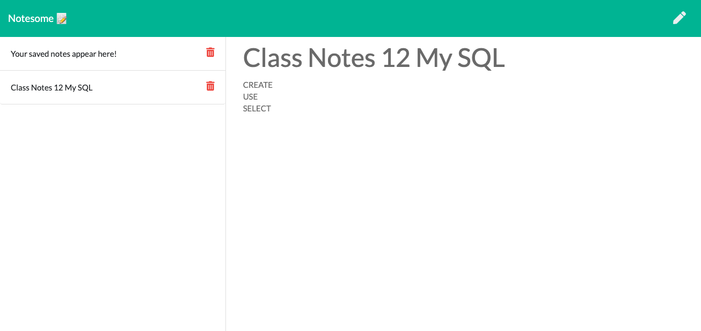

# Notesome

> An awesome note taking app that runs on express backend api routes.  

### https://notesome.herokuapp.com/

  

## Table of Contents
1. [About this project](#about)
2. [Languages Used](#laguages)
3. [Installation](#install)
4. [Usage](#usage)
5. [Contributing](#contribute)
6. [Acknowledgements](#ack)

## About This Project 

A node express application for wiriting and storing notes. Users are able to 
- Create and save notes
- View previously saved notes
- Delete previously saved notes

This project was constructed with npm inquirer. We propmt the user to input members of their engineering team: manager, engineers, and interns. Once all employee info has been entered, the app will generate and HTML file that displays a nicely formatted team roster based on the information provided.

## Languages & Technologies Used :floppy_disk: 

Powered by:
- node.js
- express

## Installation :wrench: 

`npm install express`  

## Usage :computer: 

 To start, use:  
 `node server.js`

## Contributing :v: 

Feel free to fork this repository, and open a pull request to suggest changes. 

## Acknowledgements 
- Used to help with method to remove specific item from an array: https://stackoverflow.com/questions/5767325/how-can-i-remove-a-specific-item-from-an-array

Rutgers Coding Bootcamp, 2020 :rocket: